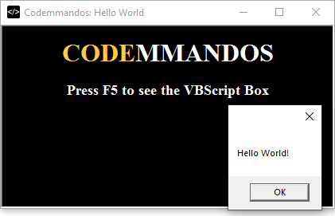

VBScript Hello World
====================

This HTA is based off the [Microsoft Example HTAs](https://docs.microsoft.com/en-us/previous-versions/windows/desktop/wiaaut/-wiaaut-getting-started-samples), and shows a simple "Hello World" when the HTA directly loads VBScript.

Note: I "officially learned" VBScript is a SUBSET of VBA [1](https://www.oreilly.com/library/view/vbscript-in-a/1565927206/ch01s03.html).
