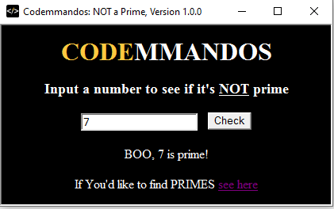

Not a Prime
===========

This HTA is based off [Rob van der Woude's 'First HTML Application'](https://www.robvanderwoude.com/vbstech_hta.php#DemoProject), but it's WORSE (e.g., it does NOT check for input validation, and who DOESN'T like primes?).

