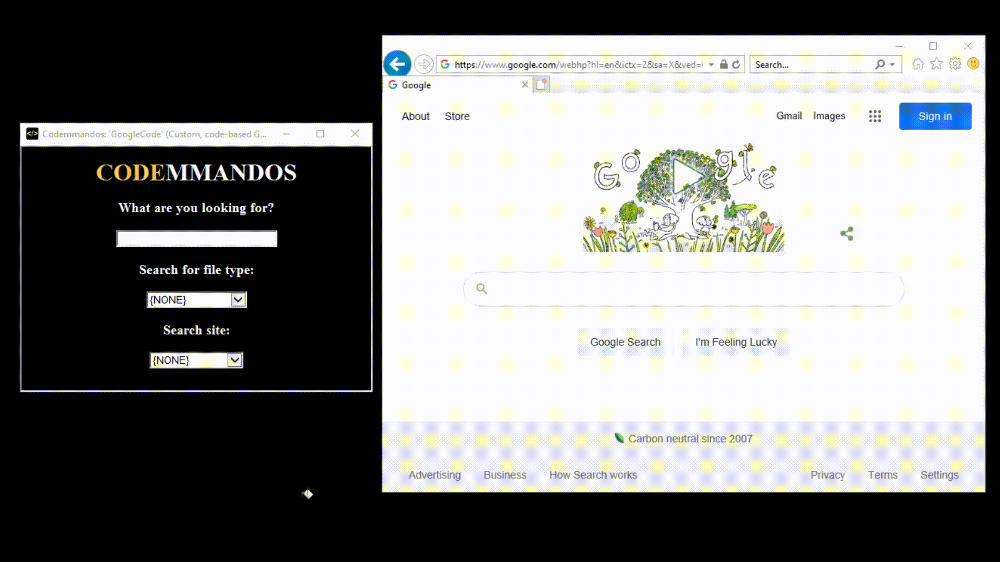
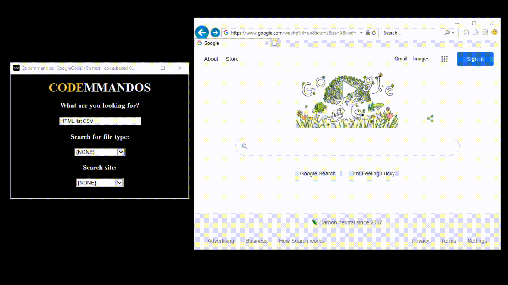
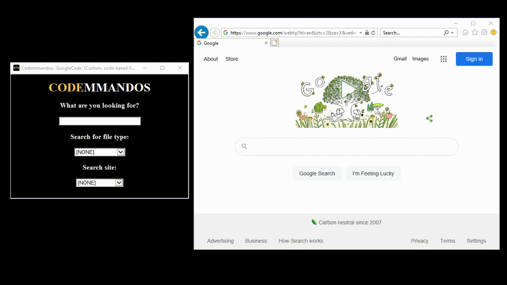

'Google Code'; or how to use Google Hacking to help find Code examples/snippets!
================================================================================
In 2004 a simple Hacker by the name Johnny Long [started passing around ideas, methods, and how-to's in leveraging Google in assisting with Infomration Security Penetration Testing](https://www.blackhat.com/presentations/bh-europe-05/BH_EU_05-Long.pdf) (i.e., Red Teaming).

The core idea behind his "Hacking" was leveraging Google, and it's "behind the scenes" search operators to laser focus searches.

One can extend this idea, but for finding Code: Enter -- "Google Code".

This HTA is based off a "Google Hacking" example [By Bob Taylor at Oakton Community College in Chicago](https://www.oakton.edu/user/2/rjtaylor/cis101/Google%20Hacking%20101.pdf), but tailored for searching for code snippets.

Here's a simple Google search (hint: when your string is done, and the cursor is blinking in the form, press Enter):

This search becomes powerful to find raw code files/examples:

And if you have a favorite website, limit you search there:

Note, because you are "sticking it to the Google-man" ... you might get "flagged" as a bot (since you lack all those fun Biscuits the Brits store in their Browsers):

Mr. Taylor's [link above](https://www.oakton.edu/user/2/rjtaylor/cis101/Google%20Hacking%20101.pdf), and [Google itself](https://support.google.com/websearch/answer/2466433?hl=en
) have direct ways to input these operators + examples. This HTA just allows you to be lazy/learn the basics of Google Hacking.

<!-- Note: to generate the GIFs -- use a bash one-line with FFMPEG: 
  for vid in 2021-04-22*; do outfile=`echo $vid | sed "s/\.mp4/\.gif/g"`; ffmpeg -i $vid -f gif $outfile; done
 -->