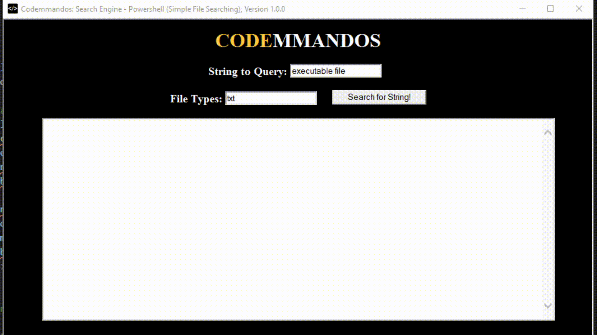

Search Engine: Text-based, Local file searching
================================================================================
The core idea behind this HTA was to take normal/quick hacks of commandline scripts into a simple GUI/HTA Search Engine.

Originally, I had tried to implement the "in-file searching" SOLELY in VBScript.
While the VBScript version "does work", it has AWFUL execution performance.

Thus, I did a fast hack of taking a simple PowerShell script `Select-String -Path .\*.txt -Pattern "executable file"` (it works in 3 seconds on 1800 files ... versus the VBScript version that barely hit 50% at 3.5 hours).
The PowerShell version using VBScript to pass the above command (with varaible input) via the shell/run commands.
Two fields are present (1) a string/search query, and (2) a file-type string .
<!-- Note: to generate the GIFs -- use a bash one-line with FFMPEG: 
  for vid in 2021-04-22*; do outfile=`echo $vid | sed "s/\.mp4/\.gif/g"`; ffmpeg -i $vid -f gif $outfile; done
 -->