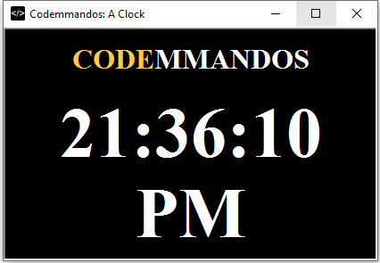

A Clock
===========

This HTA is based off [Flexiple's Programming a Clock using Javascript](https://flexiple.com/javascript-clock/).
The major change is the `let` keyword is replaced by `var` (see: [1](https://stackoverflow.com/questions/65663361/why-many-examples-of-javascript-still-using-var-instead-of-const-and-let)).
